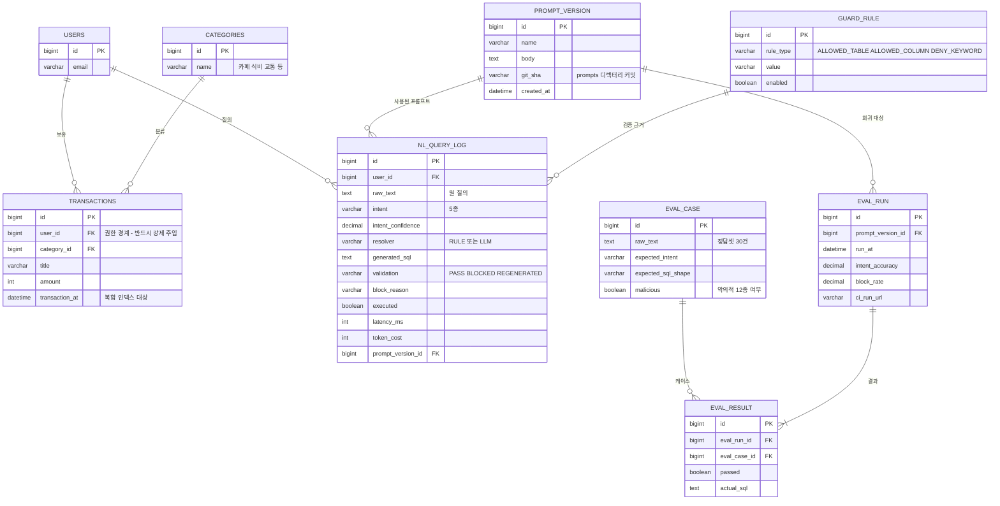

# 데이터 모델

핵심은 **NL_QUERY_LOG**다. 어떤 질의가 어떤 SQL이 됐고 무엇 때문에 통과 또는 차단됐는지가
전부 남아야 나중에 차단율과 정확도를 계산할 수 있다. 로그를 나중에 붙이면 재현이 안 된다.

## 인덱스 근거

| 인덱스 | 대상 쿼리 | 근거 |
|---|---|---|
| `idx_tx_user_cat_time (user_id, category_id, transaction_at)` | 카테고리별 기간 합계 | 등가조건 → 등가조건 → 범위·정렬 순서 |
| `idx_log_created (created_at)` | 질의 로그 조회 | 미확인 — 데이터 늘려보고 판단 |
